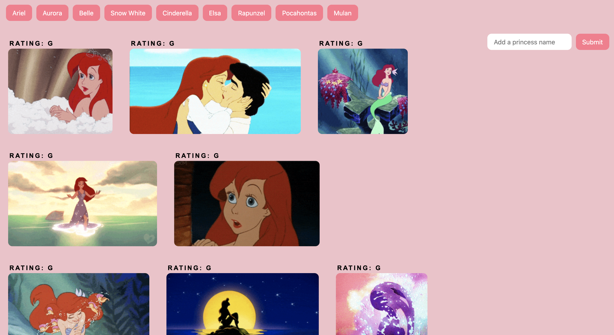

# GifTastic

Instructions:
1. Topics: Disney Princess
2. When the user clicks on a button, the page grab 10 static, non-animated git images from the GIPHY API.
3. When the user clicks one of the still GIPHY images, the gif should animate. If the user clicks the gif again, it should stop playing.
4. Under every gif, display its rating (PG,G, etc.) The data is provided by the GIPHY API. 
5. Enjoy!